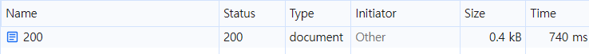
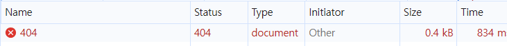
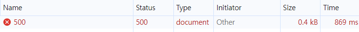

# 상태 코드별 응답 시뮬레이션 실습
>
> 사용 사이트: `https://tools-httpstatus.pickup-services.com`

 

## 테스트 URL

* [https://tools-httpstatus.pickup-services.com/200](https://tools-httpstatus.pickup-services.com/200)
* [https://tools-httpstatus.pickup-services.com/404](https://tools-httpstatus.pickup-services.com/404)
* [https://tools-httpstatus.pickup-services.com/500](https://tools-httpstatus.pickup-services.com/500)

 

## Network 탭 Status 확인 결과

| URL  | Status                    |
| ---- | ------------------------- |
| /200 | 200 OK                    |
| /404 | 404 Not Found             |
| /500 | 500 Internal Server Error |

 
## 확인 화면 정리

아래는 실제로 Network 탭에서 확인한 화면이다.

* `/200` 접속 시 → Status: **200** (document)
* `/404` 접속 시 → Status: **404** (document)
* `/500` 접속 시 → Status: **500** (document)

### 200 확인 화면

### 404 확인 화면

### 500 확인 화면

 

## 4xx와 5xx 에러 코드 비교 (404 vs 500)

| 구분    | 404 Not Found                                                       | 500 Internal Server Error                                |
| ----- | ------------------------------------------------------------------- | -------------------------------------------------------- |
| 발생 원인 | 주소를 잘못 썼거나, 예전에 있던 페이지가 없어짐                                      | 서버 코드나 설정이 잘못돼서 처리하다가 터짐                              |
| 문제 책임 | 나(사용자)나 브라우저 쪽 문제                                                   | 서버 쪽 문제                                                  |
| 해결 방법 | 주소 다시 확인하고 올바른 경로로 요청                                            | 서버 코드 고치거나 재시작, 관리자에게 물어보기                            |
| 확인 사항 | URL 오타 없는지, 파라미터 잘 썼는지, 로그인 돼 있는지 확인                          | 서버 상태 괜찮은지, 에러 로그 있는지 확인                              |
| 해결 예시 | `fetch('/api/user')` → 404 (주소 잘못 씀) `fetch('/api/users')` → 200 | `fetch('/api/users')` → 500 (서버 문제) 조금 있다가 다시 하니까 200 |
| 대표 예시 | 잘못된 페이지 주소 입력                                                       | 서버 프로그램 오류, DB 장애                                     |

 

## 정리

* 404는 보통 주소를 잘못 요청했을 때 발생했다.

* 500은 요청은 정상인데 서버 쪽에서 처리하다가 실패한 경우였다.

* Network 탭의 Status 컬럼을 보면 에러 원인이 어느 쪽인지 빠르게 구분할 수 있었다.

* 404 → 내가 길을 잘못 들은 경우

* 500 → 길은 맞는데 서버가 멈춘 경우
